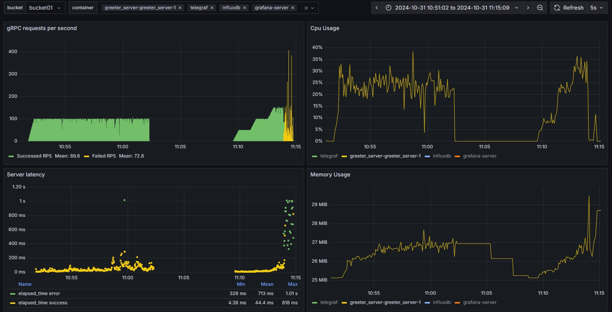

---

### Task

1) Review the setup instructions for deploying the server part of the service [here](https://grpc.io/docs/languages/go/quickstart/).
   
   a) Write a Dockerfile to run the service.

   b) Write a docker-compose configuration to run the service with 2 Gi (request = limit) and 2 Core (request = limit) resource settings.

   c) Add resource monitoring for this service.

   d) Extend the docker-compose configuration to include services for Prometheus, Grafana, and InfluxDB.

3) Write a test scenario using JMeter DSL to test the service (using the gRPC protocol).

4) Conduct stress testing to find the maximum load capacity of the service.

5) Conduct stability testing of the service.

6) Submit the results and a link to the repository containing

   a) the test scenario,

   b) test results,

   c) the docker-compose file,

   d) the Dockerfile.

   e) Include load generator utilization in the report.

---

### Additional Task (with **)

- Perform testing of the service using k6.
- Compare the testing results with those obtained using JMeter DSL.
- Write a report.

---

### Environment

OS: Windows 11 Pro, version 23H2, build 22631.4391, Windows Feature Experience Pack 1000.22700.1047.0
SubOS in WSL2:
   Distributor ID: Ubuntu
   Description:    Ubuntu 22.04.3 LTS
   Release:        22.04
   Codename:       jammy

Docker: 
   Desktop version: 4.34.3 (170107)
   Engine: 27.2.0
   Compose: v2.29.2-desktop.2

Go:
   Version: go1.23.2 linux/amd64

Java:
   SDK: 17 (Oracle OpenJDK 17.0.2)

---

### Solution:

1. Done.
   
   a. Done. Please find here greeter_server\dockerfile
   
   b. & c. & d. Done. Please find here greeter_server\docker-compose.yaml. Additionaly Telegraf service was added as metrics exporter.

2. Partially completed. Instead of the sampler plugin, a gRPC client was used,  equipped with methods for transmitting client metrics (async) and an HTTP server-trigger for gRPC transactions. Please find client code here greeter_client\main.go. 
The client is containerized with dynamic port assignment for the HTTP trigger method. This functionality is used to create a multi-threaded environment for implementing the client load in the test, as a several client conteners. Additionally was made Grafana dashboard for services monitoring, 

3. & 4. Done. Please find testplanes here tests\src\test\java\us\abstracta\jmeter\javadsl\sample\PerformanceTest.java

5. https://github.com/Sureliving/GoToGrpcTask
   
   a. The test scenario for finding the maximum load represents a stepwise load increase algorithm to determine the level at which server interaction degradation occurs. At this stage, it is necessary to confirm that the degradation originates specifically on the server side. 
   The stability (reliability) test scenario involves prolonged testing over time using the load level identified at the previous step before server failure.
   
   b. The test results indicated that server failure was weakly correlated with resource utilization, and maximum resource usage could not be achieved during testing. However, when the interaction rate exceeded 100 requests per second, the server degraded. This was due to a well-known issue with this service—see https://github.com/grpc/grpc/issues/21386. Sources confirm that the actual number of channels in the interaction pool for this service is limited to 128, and upon reaching this limit, the service does not initiate new interactions until a channel is freed. Here is some tips for workaround with the issue https://grpc.io/docs/guides/performance/, but it could affect the server code.

   
   
   c. & d. Done.
   
   e. Fail. This tests was implemented in multi-instance environment (10 client containers and IDE on Windows), it will take time to collect all metrics.

---

### Scripts and deployment plan.

Start from root project dir
cd greeter_server/
build server image

docker build -t gotogrpc/greeter_server:1.0.2 .

docker run -p 50051:50051 gotogrpc/greeter_server:1.0.2 #command to run server separately

First run docker compose with commented telegraf block, and get token in InfluxDb fot it, after this uncomment and fill token, then run again.
To monitor docker in WSL2 please pay attention for this tip https://github.com/vacp2p/wakurtosis/issues/58

docker-compose up

build client image
cd ../greeter_client/
docker build -t gotogrpc/greeter_client:1.0.3 .

docker run -d -p 8091:8091 --network=default -e PORT=8091 gotogrpc/greeter_client:1.0.3 #command to run server separately

Remove/stop unnecsessary containers on local host and run test scenario, have fun :-)
